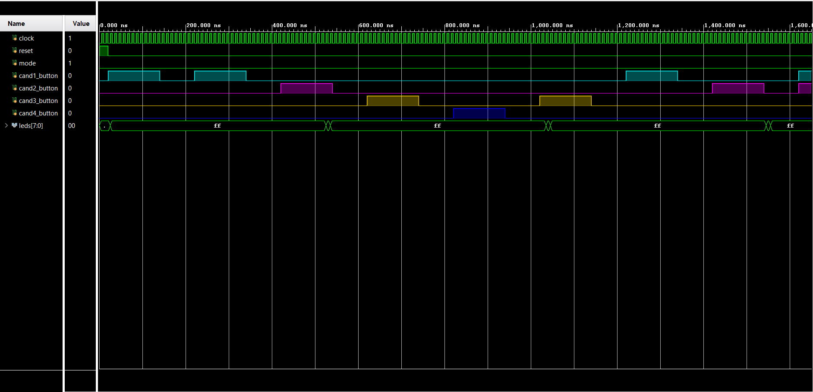
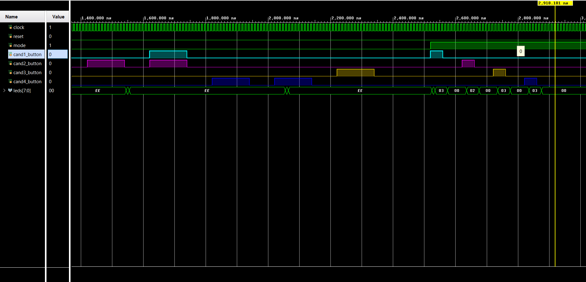

# Digital Voting Machine (Verilog)

This project is a simple Digital Voting Machine designed using Verilog HDL.  
The aim of this project is to understand how digital systems can be used to record and count votes in a structured and reliable way.

It is based on basic digital electronics concepts like FSM (Finite State Machine), counters, and modular design.

## Features
- Supports multiple candidates  
- Counts votes accurately  
- Prevents multiple voting at the same time  
- Different modes for voting, result, and reset  
- Simulated using Vivado  

## Modules Used
The project is divided into different modules:

- **buttonControl**  
  Handles input buttons for voting  

- **modeControl**  
  Controls whether the system is in voting mode, result mode, or reset  

- **fsm_voting**  
  Main logic of the system using FSM  

- **voteLogger**  
  Keeps track of votes for each candidate  

- **testing_voting**  
  Testbench used for simulation  

## Working

- Initially, the system stays in an idle state  
- When a button is pressed, the vote is registered  
- FSM ensures proper flow and avoids incorrect voting  
- In result mode, total votes can be observed  
- Reset mode clears all the votes  

## Simulation Results

Below are some waveform outputs from the simulation:

### Waveform part 1

### Waveform part 2

## Tools Used
- Verilog HDL  
- Xilinx Vivado  

## What I Learned

- Basics of FSM design  
- Writing modular Verilog code  
- Simulation and debugging  
- How a real-world system like voting machine works digitally  

## Future Improvements

- Adding display (like 7-segment)  
- Implementing on FPGA hardware  
- Improving input handling (debouncing)  

## Note
This is a learning-based project and can be improved further.
